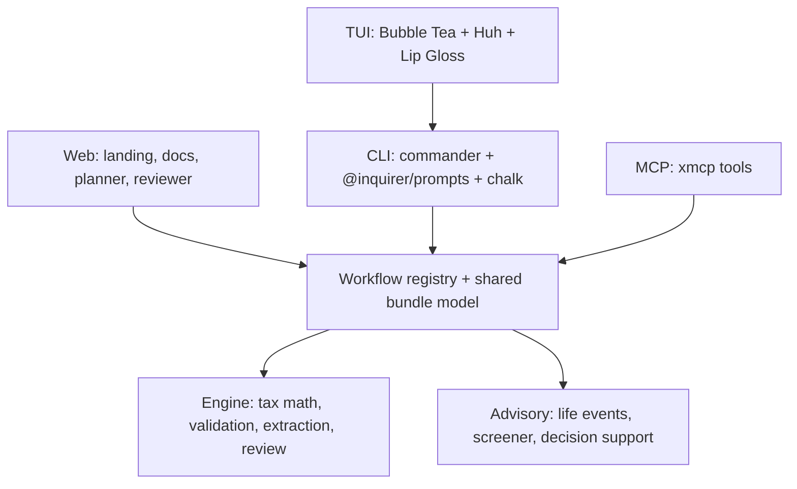

# PigeonGov

`PigeonGov` is a local-first government workflow platform for the United States. 34 workflows across 13 domains: tax, immigration, healthcare, benefits, education, veterans, identity, legal, estate, retirement, unemployment, business, and permits. Humans use it through the CLI and Bubble Tea TUI. Agents use the same workflows through MCP. The public Vercel root hosts a product site, workflow catalog, planner, and browser-side reviewer while preserving the MCP endpoint at `/mcp`.

This project targets the 2025 federal tax year for returns filed in 2026, while the broader product design follows 2026-era agentic CLI and TUI conventions.

## Install

```bash
npm install -g pigeongov
```

Or run it without installing:

```bash
npx pigeongov
```

To use the full-screen Go terminal UI from source, install Go 1.26+ and run:

```bash
pnpm build:tui
```

## Quick start

```bash
# List all 34 workflows
$ npx pigeongov workflows list

# Fill a federal tax return
$ npx pigeongov fill tax/1040

# Fill with JSON input/output
$ npx pigeongov fill immigration/family-visa-intake --json --data ./visa-input.json

# Life event action plan
$ npx pigeongov life-event job-loss

# Eligibility screening
$ npx pigeongov screen benefits/snap

# Check your environment
$ npx pigeongov doctor --json
```

## Workflows

### Tax (1)
- `tax/1040` — Federal individual return (Schedule 1, B, C, D, Form 8949)

### Immigration (5)
- `immigration/family-visa-intake` — Family visa packet intake
- `immigration/naturalization` — N-400 eligibility review
- `immigration/green-card-renewal` — I-90 filing organizer
- `immigration/daca-renewal` — DACA renewal eligibility
- `immigration/work-authorization` — I-765 EAD application

### Healthcare (2)
- `healthcare/aca-enrollment` — ACA marketplace enrollment
- `healthcare/medicare-enrollment` — Medicare with IRMAA calculation

### Benefits (6)
- `benefits/snap` — SNAP eligibility and benefit estimation
- `benefits/section8` — Section 8 Housing Choice Voucher
- `benefits/wic` — WIC program eligibility
- `benefits/liheap` — LIHEAP energy assistance
- `benefits/medicaid` — Medicaid eligibility (MAGI-based)
- `benefits/ssdi-application` — SSDI application intake

### Education (3)
- `education/fafsa` — FAFSA readiness planner
- `education/student-loan-repayment` — IDR comparison (SAVE, PAYE, IBR, ICR)
- `education/529-planner` — 529 savings projections

### Veterans (3)
- `veterans/disability-claim` — VA disability with combined rating
- `veterans/gi-bill` — Post-9/11 GI Bill estimation
- `veterans/va-healthcare` — VA healthcare priority groups

### Identity (4)
- `identity/passport` — Passport application readiness
- `identity/name-change` — Name change with cascading updates
- `identity/voter-registration` — Voter registration guide
- `identity/real-id` — REAL ID readiness checker

### Legal (3)
- `legal/small-claims` — Small claims court filing
- `legal/expungement` — Criminal record expungement
- `legal/child-support-modification` — Child support modification

### Estate (3)
- `estate/basic-will` — Basic will planner
- `estate/power-of-attorney` — Power of attorney planner
- `estate/advance-directive` — Advance directive planner

### Retirement (1)
- `retirement/ssa-estimator` — Social Security benefit estimator

### Unemployment (1)
- `unemployment/claim-intake` — Unemployment claim intake

### Business (1)
- `business/license-starter` — Business license planner *(preview)*

### Permits (1)
- `permits/local-permit-planner` — Local permit planner *(preview)*

## State tax coverage

**Full calculators:** CA, NY, IL, PA, NC, MI, GA, VA, NJ, OH

**No income tax (returns $0):** AK, FL, NV, NH, SD, TN, TX, WA, WY

## Decision support

- **What-if scenarios** — Compare filing statuses, deduction strategies, income levels
- **Audit risk scorer** — IRS DIF-inspired heuristics
- **Missed deduction detector** — Profile-based deduction suggestions
- **Contribution optimizer** — Optimal 401k, IRA, HSA strategy
- **Multi-year carryforward** — Track carryforward items across tax years

## CLI commands

| Command | Description |
|---------|-------------|
| `workflows list` | List all workflows |
| `workflows describe <id>` | Describe a workflow |
| `fill <id>` | Interactive workflow fill |
| `validate <file>` | Validate a bundle |
| `review <file>` | Review summary |
| `extract <pdf>` | Extract from source PDFs |
| `serve` | Start MCP server |
| `tui` | Launch Bubble Tea TUI |
| `doctor` | Environment check |
| `drafts` | Manage local drafts |
| `vault` | Encrypted credential storage |
| `profile` | Reusable identity profiles |
| `deadlines` | Filing deadlines |
| `fees` | Filing fees and costs |
| `glossary` | Government terminology |
| `life-event <id>` | Life event action plan |
| `screen <id>` | Eligibility screening |
| `merge` | Merge bundles |
| `scaffold` | Generate workflow plugin |
| `plugins` | Manage plugins |
| `testdata` | Generate test data |
| `schemas` | List form schemas |
| `start` | Get starter data |

All commands support `--json` for structured output and deterministic exit codes (0=success, 1=validation, 2=input, 3=system).

## Agent integration

```bash
# Claude Code
claude mcp add pigeongov -- npx pigeongov serve

# Codex
codex mcp add pigeongov -- npx pigeongov serve

# Remote MCP endpoint
https://pigeongov.vercel.app/mcp
```

Agent discovery files:
- [`agents.json`](https://pigeongov.vercel.app/agents.json) — Structured capability manifest
- [`llms.txt`](https://pigeongov.vercel.app/llms.txt) — Plain-text agent instructions

See the [full docs](https://pigeongov.vercel.app/docs/) for MCP tool reference and structured output contracts.

## Vercel deployment

```bash
vercel deploy -y --public
```

The live MCP endpoint: `https://pigeongov.vercel.app/mcp`

The public site: `https://pigeongov.vercel.app/`

For local HTTP testing:

```bash
npx pigeongov serve --http
# Listens on http://127.0.0.1:3847/mcp
```

## Architecture



## Privacy

- All processing happens locally on your machine.
- No cloud account is required for the CLI, TUI, or local MCP server.
- No telemetry is sent.
- No user data is logged.
- SSNs are masked in terminal prompts.
- The browser planner and reviewer are client-side only — no server submission.

Read the full policy in [`PRIVACY.md`](./PRIVACY.md).

## Development

```bash
pnpm install
pnpm test
pnpm typecheck
pnpm build
pnpm build:mcp
pnpm build:mcp:vercel
vercel deploy -y --public
```

## License

MIT. See [`LICENSE`](./LICENSE).
