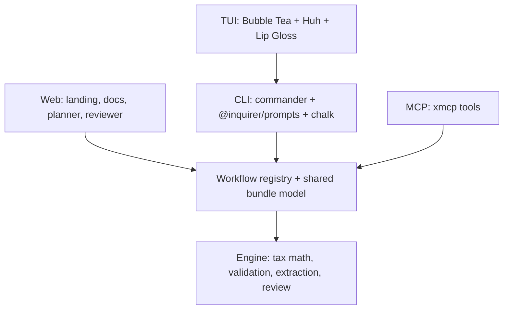

# PigeonGov

`PigeonGov` is a local-first government workflow product for the United States. It started as a tax tool and now expands into immigration packets, unemployment claims, healthcare enrollment, business-license planning, and permit planning. Humans use it through the CLI and Bubble Tea TUI. Agents use the same workflows through MCP. The public Vercel root now hosts a product site, workflow catalog, planner, and browser-side reviewer while preserving the MCP endpoint at `/mcp`.

This project still targets the 2025 federal tax year for returns filed in 2026, while the broader product design follows 2026-era agentic CLI and TUI conventions.

## Install

```bash
npm install -g pigeongov
```

Or run it without installing:

```bash
npx pigeongov
```

To use the full-screen Go terminal UI from source, install Go 1.26+ and run:

```bash
pnpm build:tui
```

## Quick start

```bash
$ npx pigeongov workflows list
$ npx pigeongov fill tax/1040
$ npx pigeongov fill immigration/family-visa-intake --json --data ./visa-input.json
$ npx pigeongov doctor --json
```

Interactive tax example:

```bash
$ npx pigeongov fill 1040

pigeongov v0.1.0 — 2025 Tax Year

? Filing status › Single
? First name › Kevin
? Last name › Lin
? SSN › ***-**-****

? Import income documents? › Yes
? Path to W-2 PDF › ./w2-acme-corp.pdf
  ✓ Extracted W-2: Acme Corp
    Wages: $50,000.00 | Fed withheld: $6,200.00

? Any 1099 forms? › No
? Any other income? › No
? Standard deduction or itemized deductions? › Standard

  ═══ Calculating ═══
  Gross income:        $50,000.00
  Standard deduction:  -$15,750.00
  Taxable income:      $34,250.00
  Federal tax:         $3,871.50
  Tax withheld:        $6,200.00
  ──────────────────────────────
  REFUND:              $2,328.50

  ✓ All validation checks passed
  ⚠ Flagged for review: (none)

? Save as › both
  ✓ Saved: ./1040-2025-filled.json
  ✓ Saved: ./1040-2025-filled.pdf

Review your return before filing. `pigeongov` does not submit to the IRS.
```

If the Go TUI is available, `pigeongov fill 1040` or `pigeongov fill immigration/family-visa-intake` will launch the full-screen workspace automatically. You can also open it directly:

```bash
pigeongov tui
pigeongov tui unemployment/claim-intake
```

## Claude Code integration

```bash
claude mcp add pigeongov -- npx pigeongov serve
```

## Codex integration

```bash
codex mcp add pigeongov -- npx pigeongov serve
```

## Vercel deployment

The Vercel deployment now serves both the public site and the MCP server:

```bash
vercel deploy -y --public
```

The live MCP endpoint remains:

```text
https://pigeongov.vercel.app/mcp
```

The public site root is:

```text
https://pigeongov.vercel.app/
```

For local HTTP testing of the same server:

```bash
npx pigeongov serve --http
```

That local server listens on `http://127.0.0.1:3847/mcp`.

## Architecture

`PigeonGov` is split into three layers:



- The workflow registry is the product contract shared by the website, CLI, TUI, and MCP.
- The engine remains deterministic and local-first.
- The CLI now supports human and machine modes with stable JSON output and exit codes.
- The TUI is a multi-workflow Bubble Tea workspace built on top of machine-readable CLI commands.
- The web root is a local-planning and review surface, not a hosted filing backend.
- The MCP server exposes the same workflows to agents and returns structured data, including `flaggedFields`.

## Available workflows

- `tax/1040`
- `immigration/family-visa-intake`
- `healthcare/aca-enrollment`
- `unemployment/claim-intake`
- `business/license-starter` (preview)
- `permits/local-permit-planner` (preview)

## Adding a new workflow

1. Add a workflow definition to `src/workflows/registry.ts`.
2. Define starter data, sections, evidence logic, and validation/review rules.
3. Reuse the shared bundle contract so the CLI, TUI, site, and MCP all inherit the new workflow.
4. If the workflow needs underlying form schemas, add or extend `src/schemas/`.
5. Add tests for registry behavior, CLI output, and MCP tool integration.

## Privacy

- All processing happens locally on your machine.
- No cloud account is required for the CLI, TUI, or local MCP server.
- No telemetry is sent.
- No user tax data should be logged.
- SSNs should be masked in terminal prompts.
- The browser planner and reviewer are client-side surfaces; they do not submit to agencies.

Read the full policy in [`PRIVACY.md`](./PRIVACY.md).

## Roadmap

- Immigration forms
- State taxes
- More business-license and permit workflows
- Guided packet assembly across additional federal and state programs

## Development

Typical workflows:

```bash
pnpm install
pnpm test
pnpm typecheck
pnpm build
pnpm build:mcp
pnpm build:mcp:vercel
vercel deploy -y --public
```

## License

MIT. See [`LICENSE`](./LICENSE).
